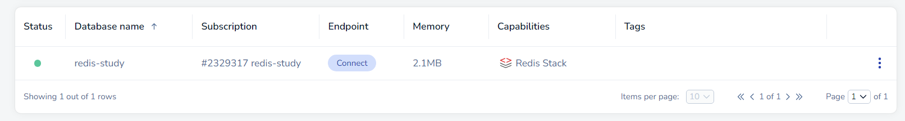
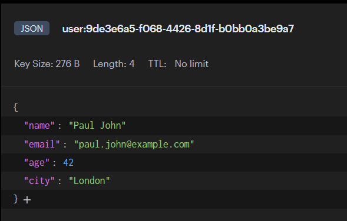

# First Steps

- Create a free (or paied whatever) account on [redis labs](https://app.redislabs.com/#/) - you can also run localy if you prefer
- create a new database

- fallow the [redis.io](https://redis.io/docs/latest/develop/connect/clients/dotnet/) documentation 👌

- download any GUI or CLI for checking out your redis data i.e [Redis Insight](https://redis.io/insight/)

# Result

